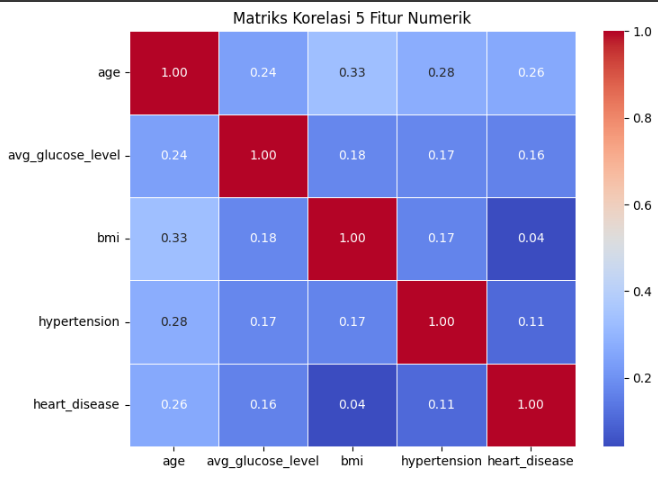
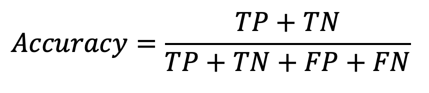
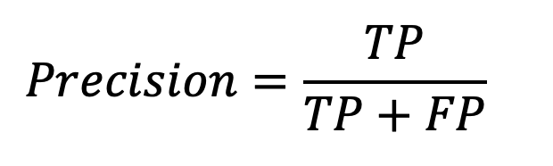
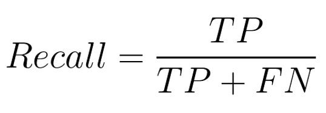
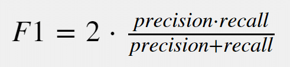
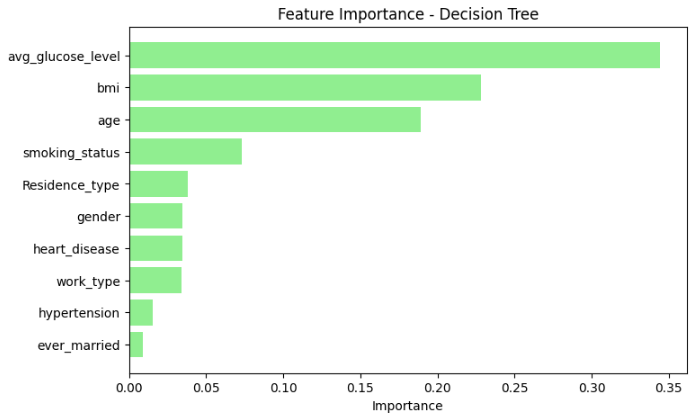
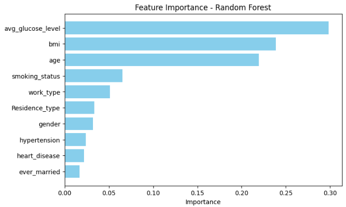
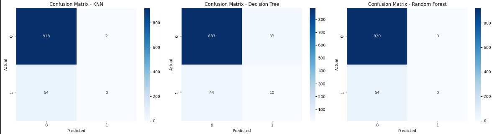

# Laporan Proyek Machine Learning - Rahmah Sary Fadiyah

## Domain Proyek : Kesehatan

Stroke merupakan salah satu penyebab utama kematian dan kecacatan jangka panjang di seluruh dunia. Menurut World Health Organization (WHO), sekitar 15 juta orang mengalami stroke setiap tahunnya, dan sekitar 5 juta di antaranya meninggal dunia sementara 5 juta lainnya mengalami kecacatan permanen [1].

Stroke terjadi ketika pasokan darah ke otak terganggu atau berkurang, sehingga jaringan otak tidak mendapatkan oksigen dan nutrisi yang cukup. Dalam banyak kasus, stroke bisa dicegah apabila faktor risikonya dapat dikenali sejak dini, seperti faktor utama penyebab stroke adalah hipertensi, selain itu juga faktor resiko laninya adalah merokok, diabetes melitus dan dispidemia [2]. Selain hipertensi, penyebab stroke bisa dipengaruhi oleh ras/suku, jenis kelamin dan usia. Usia yang paling tinggi beresiko terkena stroke  yaitu usia lansia ≥75tahun [3].

Namun, banyak pasien tidak menyadari adanya risiko ini sampai mereka benar-benar mengalami stroke. Oleh karena itu, pemanfaatan teknologi prediktif berbasis machine learning dapat menjadi solusi untuk mendeteksi potensi stroke lebih awal dengan memanfaatkan data medis dan gaya hidup pasien.

Dengan pendekatan klasifikasi, proyek ini bertujuan membangun model prediksi yang dapat mengidentifikasi individu dengan risiko tinggi stroke, sehingga tindakan pencegahan dapat dilakukan secara proaktif.

## Business Understanding
### Problem Statements
Permasalahan dari statement ini adalah:
- Bagaimana cara mengidentifikasi individu dengan risiko tinggi terkena stroke menggunakan data kesehatan dasar dan gaya hidup?
- Apa saja fitur (variabel) yang paling berpengaruh terhadap risiko stroke pada individu?
- Seberapa akurat model klasifikasi yang dikembangkan dalam memprediksi kejadian stroke?

### Goals
Menjelaskan tujuan dari pernyataan masalah:
- Mengembangkan model klasifikasi berbasis machine learning untuk memprediksi apakah seseorang berisiko mengalami stroke atau tidak.
- Melakukan eksplorasi data dan analisis fitur untuk mengetahui faktor-faktor signifikan yang memengaruhi risiko stroke.
- Mengevaluasi performa model prediksi menggunakan metrik evaluasi seperti akurasi, precision, recall, dan F1-score 

### Solution statements
- Menganalisis dataset secara eksploratif untuk memahami distribusi fitur dan target dari dataset stroke
- Selanjutnya, dilakukan percobaan menggunakan tiga algoritma berbeda yaitu K-Nearest Neighbors (KNN), Decision Tree, dan Random Forest. Setiap model dilatih dan dievaluasi menggunakan metrik yang sama
- Berdasarkan keseluruhan hasil evaluasi, model terbaik dipilih dengan mempertimbangkan akurasi tinggi.

## Data Understanding
Dataset Stroke Prediction didapatkan dari Kaggle dataset ini digunakan untuk memprediksi apakah seorang pasien berisiko mengalami stroke berdasarkan beberapa parameter input seperti jenis kelamin, usia, riwayat penyakit (seperti hipertensi dan penyakit jantung), serta status merokok. Setiap baris dalam dataset ini memberikan informasi relevan mengenai masing-masing pasien, yang dapat membantu dalam membangun model prediktif untuk deteksi dini dan pencegahan stroke. Informasi Metadata, Pemilik/Author fedesoriano. untuk detail informasinya seperti dibawah:

- **URL/tautan sumber data** : https://www.kaggle.com/datasets/fedesoriano/stroke-prediction-dataset
- **Jumlah baris dan kolom**

  Dalam data tersebut terdapat 12 kolom yang terdiri dari:
  
  - **id**: Merupakan ID unik untuk setiap pasien, bertipe data integer.
  - **gender** Menunjukkan jenis kelamin pasien dengan nilai "Male", "Female", atau "Other".
  - **age**: Usia pasien dalam bentuk numerik (float).
  - **hypertension**: Bernilai 0 jika pasien tidak menderita hipertensi, dan 1 jika menderita.
  - **heart_disease**: Bernilai 0 jika pasien tidak memiliki penyakit jantung, dan 1 jika memiliki.
  - **ever_married**: Status pernikahan pasien, dengan nilai "Yes" atau "No".
  - **work_type**: Jenis pekerjaan pasien, bisa berupa "children", "Govt_job", "Never_worked", "Private", atau "Self-employed".
  - **Residence_type**: Jenis tempat tinggal pasien, antara "Urban" dan "Rural".
  - **avg_glucose_level**: Rata-rata kadar glukosa darah pasien dalam satuan numerik (float).
  - **bmi**: Indeks massa tubuh pasien dalam bentuk numerik (float).
  - **smoking_status**: Status merokok pasien, terdiri dari "formerly smoked", "never smoked", "smokes", atau "Unknown".
  - **stroke**: Label target, bernilai 1 jika pasien pernah mengalami stroke, dan 0 jika tidak.
    
  Sedangkan untuk jumlah data terdiri dari 5110 baris
  | No | Kolom               | Non-Null Count | Tipe Data |
  |----|---------------------|----------------|-----------|
  | 0  | id                  | 5110 non-null  | int64     |
  | 1  | gender              | 5110 non-null  | object    |
  | 2  | age                 | 5110 non-null  | float64   |
  | 3  | hypertension        | 5110 non-null  | int64     |
  | 4  | heart_disease       | 5110 non-null  | int64     |
  | 5  | ever_married        | 5110 non-null  | object    |
  | 6  | work_type           | 5110 non-null  | object    |
  | 7  | Residence_type      | 5110 non-null  | object    |
  | 8  | avg_glucose_level   | 5110 non-null  | float64   |
  | 9  | bmi                 | 4909 non-null  | float64   |
  | 10 | smoking_status      | 5110 non-null  | object    |
  | 11 | stroke              | 5110 non-null  | int64     |
 
- **Kondisi data. (missing value, duplikat, dan outlier)**
  - missing value
    
     | Kolom              | Jumlah Missing Value |
     |--------------------|----------------------|
     | id                 | 0                    |
     | gender             | 0                    |
     | age                | 0                    |
     | hypertension       | 0                    |
     | heart_disease      | 0                    |
     | ever_married       | 0                    |
     | work_type          | 0                    |
     | Residence_type     | 0                    |
     | avg_glucose_level  | 0                    |
     | bmi                | 201                  |
     | smoking_status     | 0                    |
     | stroke             | 0                    |

    Menurut tabel data diatas terdapat missing value di kolom `bmi` sebanyak 201 data.

 - Duplikat value
   | Data               | Jumlah Duplicat Value|
   |--------------------|----------------------|
   | data               | 0                    |

   Data yang tersedia telah diperiksa dan tidak ditemukan adanya duplikasi. Hal ini menunjukkan bahwa setiap entri dalam dataset bersifat unik dan tidak berulang.
   
- Data outlier

| Statistik    | gender | age   | hypertension | heart_disease | ever_married | work_type | Residence_type | avg_glucose_level | bmi    | smoking_status |
|--------------|--------|-------|--------------|---------------|--------------|-----------|----------------|-------------------|--------|----------------|
| Count        | 4909   | 4909  | 4909         | 4909          | 4909         | 4909      | 4909           | 4909              | 4909   | 4909           |
| Mean         | 0.41   | 42.87 | 0.09         | 0.05          | 0.65         | 2.17      | 0.51           | 105.31            | 28.89  | 1.38           |
| Std Dev      | 0.49   | 22.56 | 0.29         | 0.22          | 0.48         | 1.09      | 0.50           | 44.42             | 7.85   | 1.07           |
| Min          | 0      | 0.08  | 0            | 0             | 0            | 0         | 0              | 55.12             | 10.30  | 0              |
| 25% (Q1)     | 0      | 25    | 0            | 0             | 0            | 2         | 0              | 77.07             | 23.50  | 0              |
| 50% (Median) | 0      | 44    | 0            | 0             | 1            | 2         | 1              | 91.68             | 28.10  | 2              |
| 75% (Q3)     | 1      | 60    | 0            | 0             | 1            | 3         | 1              | 113.57            | 33.10  | 2              |
| Max          | 2      | 82    | 1            | 1             | 1            | 4         | 1              | 271.74            | 97.60  | 3              |

Berikut penjelasan singkat dalam bentuk kalimat untuk setiap atribut pada dataset:
- Gender menunjukkan jenis kelamin responden yang sudah diubah ke bentuk numerik, mayoritas adalah perempuan (nilai 0).
- Age adalah usia responden. Terdapat nilai yang tidak logis yaitu 0.08 tahun (sekitar 29 hari), sehingga bisa dianggap sebagai outlier dan perlu dihapus.
- Hypertension adalah status hipertensi (0 = tidak, 1 = ya), dengan rata-rata 9% dari responden memiliki hipertensi.
- Heart Disease menunjukkan apakah responden memiliki penyakit jantung (0 = tidak, 1 = ya), dengan rata-rata hanya 5%.
- Ever Married adalah status pernikahan (0 = belum, 1 = sudah), dengan mayoritas responden sudah menikah.
- Work Type adalah jenis pekerjaan yang telah dikodekan, mayoritas bekerja di sektor swasta.
- Residence Type menunjukkan tempat tinggal (0 = pedesaan, 1 = perkotaan), distribusinya hampir seimbang.
- Average Glucose Level adalah kadar glukosa rata-rata dalam darah. Terdapat beberapa nilai tinggi (>200) yang masih masuk akal secara medis.
- BMI (Body Mass Index) menunjukkan indeks massa tubuh.
- Smoking Status adalah status merokok yang telah diubah ke bentuk numerik. Beberapa data memiliki kategori "Unknown" yang jumlahnya cukup banyak.

| Pasangan Fitur                  | Korelasi | Interpretasi                                                                 |
|--------------------------------|----------|------------------------------------------------------------------------------|
| age – bmi                      | 0.33     | Korelasi positif sedang – Semakin tua, cenderung BMI semakin tinggi.        |
| age – hypertension             | 0.28     | Korelasi positif lemah – Usia yang lebih tua cenderung memiliki hipertensi. |
| age – heart_disease            | 0.26     | Korelasi positif lemah – Usia meningkat sedikit berkaitan dengan penyakit jantung. |
| age – avg_glucose_level        | 0.24     | Korelasi positif lemah – Glukosa rata-rata sedikit meningkat seiring bertambahnya usia. |
| bmi – avg_glucose_level        | 0.18     | Korelasi sangat lemah – Hubungan yang hampir tidak signifikan.              |
| bmi – hypertension             | 0.17     | Korelasi sangat lemah – Orang dengan BMI tinggi sedikit cenderung memiliki hipertensi. |
| avg_glucose_level – hypertension | 0.17   | Korelasi sangat lemah – Hubungan sangat kecil antara kadar glukosa dan hipertensi. |
| avg_glucose_level – heart_disease | 0.16 | Korelasi sangat lemah – Hampir tidak ada korelasi antara glukosa dan penyakit jantung. |
| bmi – heart_disease            | 0.04     | Korelasi hampir tidak ada – BMI tidak berhubungan signifikan dengan penyakit jantung. |
| hypertension – heart_disease  | 0.11     | Korelasi sangat lemah – Sedikit hubungan antara hipertensi dan penyakit jantung. |

## Data Preparation
Data preparation adalah tahap penting sebelum membangun model machine learning. Tahapan ini bertujuan untuk membersihkan, mengubah, dan menyusun ulang data agar dapat digunakan secara optimal oleh algoritma. Berikut adalah tahapan yang dilakukan:
- **Menghapus fitur yang tidak diperlukan**
  Kolom `id` dihapus dari dataset karena tidak memberikan kontribusi terhadap analisis maupun pemodelan. Kolom ini hanya berfungsi sebagai identitas unik dan tidak memiliki nilai prediktif.

- **Menghapus missing value**
  Dataset memiliki kolom bmi dengan sebagian nilai kosong (NaN). Untuk mengatasi hal ini, baris yang memiliki nilai kosong dihapus. Karena hanya sebagian kecil dari total baris yang memiliki missing value, dan kolom tersebut merupakan data numerik yang cukup sensitif, maka penghapusan lebih disarankan daripada imputasi. Imputasi bisa menambahkan bias jika tidak dilakukan dengan hati-hati.
   | Kolom              | Jumlah Missing Value |
   |--------------------|----------------------|
   | id                 | 0                    |
   | gender             | 0                    |
   | age                | 0                    |
   | hypertension       | 0                    |
   | heart_disease      | 0                    |
   | ever_married       | 0                    |
   | work_type          | 0                    |
   | Residence_type     | 0                    |
   | avg_glucose_level  | 0                    |
   | bmi                | 0                    |
   | smoking_status     | 0                    |
   | stroke             | 0                    |

   Hasil pengecekan menunjukkan bahwa seluruh kolom telah bersih dari data yang kosong, termasuk kolom bmi yang sebelumnya memiliki 201 missing value dan telah ditangani. Dengan kondisi data yang sudah lengkap dan konsisten, maka data siap untuk diproses lebih lanjut dalam tahap analisis atau pemodelan machine learning.

- **Menghapus Nilai Tidak Logis (Outlier)**
  Pada kolom age, terdapat data dengan nilai minimum 0.08 tahun, yang jika dikonversi hanya sekitar 29 hari. Ini sangat tidak relevan untuk kasus stroke. Stroke hampir tidak pernah terjadi pada bayi baru lahir, sehingga nilai tersebut tidak logis dan dianggap sebagai outlier ekstrem. Data dengan age < 1 tahun dihapus.
  
- **Encoding fitur kategori**
  Kolom kategorikal seperti gender, ever_married, work_type, Residence_type, dan smoking_status diubah menjadi angka menggunakan LabelEncoder. Model machine learning umumnya hanya dapat memproses data numerik. Encoding mengubah string menjadi representasi numerik sehingga dapat digunakan dalam model.

- **Pembagian dataset dengan fungsi train_test_split dari library sklearn**
  Memisahkan data menjadi dua bagian: data pelatihan (80%) dan data pengujian (20%) dengan train_test_split dari sklearn. Model perlu diuji pada data yang belum pernah dilihat untuk mengetahui seberapa baik kemampuannya melakukan generalisasi.
  
- **Standarisasi.**
  Melakukan standardisasi pada fitur numerik menggunakan StandardScaler, agar semua fitur memiliki distribusi dengan mean 0 dan standar deviasi 1.Beberapa algoritma seperti K-Nearest Neighbors (KNN) atau algoritma berbasis jarak sangat dipengaruhi oleh skala data. Fitur dengan skala lebih besar dapat mendominasi hasil.
  
**KESIMPULAN perlu dilakukan data prepration**
- Proses data preparation sangat krusial karena data mentah seringkali mengandung berbagai masalah seperti nilai kosong, data tidak logis, skala tidak seragam, hingga tipe data yang tidak sesuai. Jika tidak diproses dengan benar, kualitas dan akurasi model yang dibangun bisa menurun drastis.
- Dengan membersihkan data dari missing value dan outlier, kita memastikan data yang digunakan representatif dan dapat dipercaya. Encoding diperlukan agar algoritma dapat memproses fitur kategorikal secara numerik. Pembagian dataset ke dalam data latih dan uji membantu menghindari overfitting dan mengevaluasi performa model secara objektif. Terakhir, standarisasi menjamin bahwa semua fitur numerik memiliki kontribusi yang seimbang dalam pelatihan model.
Tanpa tahapan ini, risiko kesalahan interpretasi model dan penurunan performa menjadi sangat tinggi. Oleh karena itu, data preparation adalah langkah fundamental sebelum memasuki tahap pemodelan machine learning.

## Modeling
Tahapan ini membahas proses membangun model machine learning dengan tiga algoritma berbeda, yaitu K-Nearest Neighbors (KNN), Decision Tree, dan Random Forest. Setiap model dilatih menggunakan dataset yang telah dibersihkan dan distandarisasi, lalu dilakukan evaluasi menggunakan metrik akurasi dan confusion matrix untuk memilih model terbaik.
 - **Model 1: K-Nearest Neighbors (KNN)**
   - `from sklearn.neighbors import KNeighborsClassifier` Mengimpor kelas KNeighborsClassifier dari pustaka scikit-learn. KNN adalah algoritma berbasis *instance-based learning*.
   - `knn = KNeighborsClassifier(n_neighbors=5)` Membuat objek model KNN dengan parameter n_neighbors=5, yang artinya model akan memprediksi label berdasarkan 5 tetangga terdekat.
   - `knn_preds = knn.predict(X_test)` Melakukan prediksi pada data uji X_test menggunakan model KNN yang sudah dilatih.

   - **Cara Kerja KNN:**
      - KNN bekerja dengan mencari k tetangga terdekat dari data yang akan diprediksi berdasarkan jarak (umumnya Euclidean).
      - Label yang paling sering muncul di antara tetangga terdekat akan digunakan sebagai hasil prediksi.

    - **Kelebihan:**
       - **Sederhana dan intuitif**: KNN adalah algoritma non-parametrik berbasis instance, yang sangat mudah diimplementasikan dan tidak memerlukan asumsi distribusi data.
       - **Tidak memerlukan proses pelatihan eksplisit**: Karena bersifat lazy learner, seluruh proses klasifikasi terjadi saat prediksi, sehingga waktu pelatihan hampir tidak ada.
       - **Dapat digunakan untuk klasifikasi dan regresi**: Meski lebih umum digunakan untuk klasifikasi, KNN juga fleksibel untuk tugas regresi.

    - **Kekurangan:**
      - **Komputasi berat pada saat prediksi**: Karena membandingkan setiap data uji dengan seluruh data latih, waktu prediksi menjadi lambat jika dataset besar.
      - **Sangat sensitif terhadap fitur yang tidak relevan atau memiliki skala berbeda**: Fitur yang memiliki skala lebih besar bisa mendominasi hasil perhitungan jarak jika tidak dilakukan normalisasi atau standarisasi.
      - **Performa buruk pada data berdimensi tinggi (curse of dimensionality)** : Jarak antar titik cenderung menjadi homogen, sehingga efektivitas penentuan tetangga terdekat menurun.

 - **Decision Tree**
    - `from sklearn.tree import DecisionTreeClassifier`  Mengimpor kelas DecisionTreeClassifier dari scikit-learn. Model ini digunakan untuk klasifikasi berbasis Desicion tree.
    -`dt = DecisionTreeClassifier(random_state=42)`  Membuat objek model Decision Tree dengan seed acak 42 agar hasil konsisten.
    - `dt.fit(X_train, y_train)`  Melatih model dengan data latih X_train dan y_train.
    - `dt_preds = dt.predict(X_test)` Menghasilkan prediksi label dari data uji X_test.

    - **Cara Kerja Decision Tree:**
       - Decision Tree memecah data berdasarkan fitur yang memberikan informasi paling banyak (impurity minimum) menggunakan kriteria seperti Gini atau Entropy.
       - Setiap cabang menyaring data berdasarkan nilai fitur hingga daun (leaf) tercapai.

    - **Kelebihan:**
      - **Mudah dimengerti dan divisualisasikan**: Model ini mirip dengan struktur pohon logika, sehingga cocok untuk interpretasi oleh non-teknisi.
      - **Tidak memerlukan normalisasi data**: Berbeda dengan KNN, Decision Tree dapat menangani fitur numerik dan kategorikal tanpa perlu preprocessing skala.
      - **Cepat dalam pelatihan dan prediksi**: Karena hanya membangun satu struktur pohon, proses ini efisien untuk data ukuran sedang.

    - **Kekurangan:**
       - **Mudah overfitting**: Tanpa teknik pruning atau batasan kedalaman, pohon cenderung belajar terlalu detail dan gagal melakukan generalisasi.
       - **Rentan terhadap perubahan data kecil**: Perubahan kecil dalam dataset dapat menghasilkan struktur pohon yang sangat berbeda (kurang stabil).
       - **Tidak optimal pada data yang sangat kompleks**: Model cenderung menghasilkan keputusan yang terlalu deterministik dan tidak fleksibel.

 - **Random Forest**
    - `from sklearn.ensemble import RandomForestClassifier` Mengimpor kelas RandomForestClassifier dari pustaka scikit-learn
    - `rf = RandomForestClassifier(n_estimators=100, random_state=42)`  Membuat objek model Random Forest dengan parameter:
        - `n_estimators=100` berarti model akan menggunakan 100 pohon keputusan dalam ensemble-nya (semakin banyak, semakin stabil prediksi, tapi lebih lambat).
        - random_state=42 adalah angka acak tetap untuk reproducibility — agar hasilnya selalu sama setiap kali dijalankan.
    - `rf.fit(X_train, y_train)` Melatih (training) model Random Forest menggunakan data latih X_train (fitur) dan y_train (label/target). Model akan mempelajari pola hubungan antara fitur dan target dari data tersebut.
    - `rf_preds = rf.predict(X_test)` Menggunakan model yang telah dilatih untuk memprediksi data uji (X_test), hasil prediksi disimpan dalam variabel rf_preds, yang berisi kelas/label hasil prediksi untuk masing-masing baris dalam X_test.

   - **Cara Kerja Random Forest:**
      - Random Forest membangun banyak pohon keputusan dengan variasi data dan fitur, lalu menggabungkan hasil prediksi secara voting (klasifikasi) atau rata-rata (regresi).
      - Teknik ini sangat kuat terhadap overfitting, karena variasi antara pohon membantu menurunkan varian keseluruhan.

    - **Kelebihan:**
      - **Mengurangi overfitting**: Dengan menggabungkan banyak pohon (ensembling), model lebih robust dan tidak terlalu terpengaruh oleh noise atau data outlier.
      - **Akurasi tinggi dan stabil**: Random Forest cenderung menghasilkan performa prediksi yang lebih baik dibandingkan Decision Tree tunggal karena rata-rata hasil dari banyak model.
      - **Dapat mengukur pentingnya fitur** : Algoritma ini menyediakan informasi tentang seberapa besar pengaruh setiap fitur terhadap keputusan akhir.
      - **Toleran terhadap missing value dan data tidak seimbang**: Berkat metode bootstrapping dan voting.

     - **Kekurangan:**
       - **Lebih kompleks dan sulit diinterpretasi**: Tidak seperti Decision Tree tunggal, hasil model ini sulit dijelaskan ke non-teknisi karena terdiri dari banyak pohon.
       - **Penggunaan memori lebih besar**: Karena menyimpan banyak pohon, model ini membutuhkan lebih banyak RAM dan waktu pelatihan.
       - **Lambat saat prediksi**: Meski lebih cepat daripada KNN, prediksi pada Random Forest tetap lebih lambat dibanding model sederhana karena banyaknya komponen (n_estimators).

## Evaluation
Dalam proyek klasifikasi ini, conflusion metriks dimana:  
   - TP = True Positive (jumlah prediksi positif yang benar)  
   - TN = True Negative (jumlah prediksi negatif yang benar)  
   - FP = False Positive (jumlah prediksi positif yang salah)  
   - FN = False Negative (jumlah prediksi negatif yang salah)
 
1. **Akurasi (Accuracy)**  
   Akurasi mengukur proporsi prediksi yang benar dari keseluruhan data. Akurasi tinggi tidak selalu berarti model bagus, terutama kalau dataset sangat tidak seimbang (misal kelas positif sangat sedikit). Karena model bisa saja hanya memprediksi kelas mayoritas dan tetap mendapatkan akurasi tinggi. 
   **Formula:**
   

3. **Precision (Presisi)**
   Mengukur seberapa banyak prediksi positif yang benar. Jika precision = 0, berarti model tidak bisa memprediksi positif dengan benar sama sekali.
   **Formula:**  
   

5. **Recall (Sensitivitas)**  
   Recall mengukur seberapa baik model dalam menemukan seluruh kasus positif yang sebenarnya.  
   **Formula:**
   

6. **F1 Score**  
   F1 Score adalah harmonic mean dari precision dan recall yang memberikan keseimbangan antara keduanya.  
    

## Hasil Evaluasi Proyek

| Model         | Train Accuracy | Test Accuracy | Train Precision | Test Precision | Train Recall | Test Recall | Train F1 | Test F1 |
|---------------|----------------|----------------|------------------|-----------------|---------------|--------------|-----------|----------|
| KNN           | 0.9602         | 0.9425         | 0.5000           | 0.0000          | 0.0194        | 0.0000       | 0.0373    | 0.0000   |
| Decision Tree | 1.0000         | 0.9209         | 1.0000           | 0.2326          | 1.0000        | 0.1852       | 1.0000    | 0.2062   |
| Random Forest | 0.9997         | 0.9446         | 1.0000           | 0.0000          | 0.9935        | 0.0000       | 0.9968    | 0.0000   |

Dari hasil evaluasi, dapat disimpulkan bahwa:
- **KNN (K-Nearest Neighbors)**
  Meskipun akurasi training dan testing KNN terlihat cukup tinggi (96% dan 94.25%), nilai precision, recall, dan F1 score pada data testing adalah 0.0000. Hal ini menunjukkan bahwa model KNN gagal mengklasifikasikan kelas positif sama sekali pada data uji. Dengan kata lain, KNN mengalami zero precision dan zero recall, sehingga tidak cocok digunakan untuk kasus ini. Model KNN tidak menyediakan feature importance karena cara kerjanya berdasarkan pengukuran jarak antar titik data, bukan pembelajaran pola fitur secara eksplisit.

- **Decision Tree**
  Decision Tree memiliki akurasi 100% pada data training, namun hanya 92.09% pada data testing. Meski begitu, model masih memberikan precision sebesar 23.26% dan recall 18.52% di testing, menghasilkan F1 score sebesar 0.2062. Ini lebih baik dibanding KNN, namun performanya masih tergolong rendah dalam mendeteksi kelas positif.

  

  Berdasarkan hasil feature importance dari model Decision Tree, dapat disimpulkan bahwa tiga fitur paling berpengaruh dalam memprediksi risiko stroke adalah tingkat glukosa darah rata-rata (avg_glucose_level), indeks massa tubuh (BMI), dan usia (age). Ketiga fitur ini memiliki nilai kontribusi yang jauh lebih tinggi dibandingkan fitur lainnya, menandakan bahwa model sangat mengandalkan informasi dari ketiganya untuk mengambil keputusan klasifikasi.
  
- **Random Forest**
Model ini memiliki performa sangat baik pada data training (hampir sempurna), tetapi precision, recall, dan F1 score-nya nol pada data testing. Artinya, Random Forest mengalami overfitting ekstrem dan gagal mengeneralisasi ke data baru, serupa dengan KNN. Kemungkinan besar, kelas minoritas tidak terdeteksi sama sekali dalam proses prediksi testing.

 

Berdasarkan hasil feature importance dari model Random Forest, dapat disimpulkan bahwa tiga fitur paling berpengaruh dalam memprediksi risiko stroke adalah tingkat glukosa darah rata-rata (avg_glucose_level), indeks massa tubuh (BMI), dan usia (age). Ketiga fitur ini memiliki nilai kontribusi yang jauh lebih tinggi dibandingkan fitur lainnya, menandakan bahwa model sangat mengandalkan informasi dari ketiganya untuk mengambil keputusan klasifikasi.

  
  
  Berdasarkan hasil visualisasi confusion matrix, model KNN menghasilkan 0 True Positive (TP), 54 False Negative (FN), 918 True Negative (TN), dan 2 False Positive (FP). Model Decision Tree menunjukkan 10 TP, 44 FN, 887 TN, dan 33 FP. Sementara itu, model Random Forest memiliki 0 TP, 54 FN, 920 TN, dan 0 FP. Nilai-nilai ini mencerminkan bagaimana masing-masing model melakukan klasifikasi terhadap kelas positif dan negatif pada data pengujian.

**Memilih model terbaik**

- **Decision Tree lebih baik dibanding KNN dan Random Forest** untuk kasus ini karena masih memberikan nilai precision, recall, dan F1 score di data testing, walaupun performanya masih rendah secara absolut.
- KNN dan Random Forest gagal sama sekali dalam mendeteksi kelas positif pada data testing (precision dan recall = 0).

## Kesimpulan EVALUASI

### 1. Bagaimana cara mengidentifikasi individu dengan risiko tinggi terkena stroke menggunakan data kesehatan dasar dan gaya hidup?
- Dengan memanfaatkan algoritma klasifikasi machine learning yang dilatih menggunakan data kesehatan dasar dan gaya hidup (seperti usia, jenis kelamin, hipertensi, penyakit jantung, status menikah, tipe pekerjaan, tempat tinggal, status merokok, BMI, dan kadar glukosa), sistem mampu mengidentifikasi individu yang berisiko tinggi terkena stroke.
- Proses ini mencakup tahapan: *data preprocessing*, *pelatihan model*, dan *evaluasi performa model*, sehingga pola-pola risiko dapat dikenali secara otomatis.

### 2. Apa saja fitur (variabel) yang paling berpengaruh terhadap risiko stroke pada individu?

- Semua fitur berikut digunakan sebagai input dalam model prediksi risiko stroke:
  - **Gender (jenis kelamin)**
  - **Age (usia)**
  - **Hypertension (hipertensi)**
  - **Heart Disease (riwayat penyakit jantung)**
  - **Ever Married (status pernikahan)**
  - **Work Type (jenis pekerjaan)**
  - **Residence Type (tipe tempat tinggal)**
  - **Average Glucose Level (tingkat glukosa darah rata-rata)**
  - **BMI (indeks massa tubuh)**
  - **Smoking Status (status merokok)**

- Dari seluruh fitur tersebut, hasil pelatihan model menunjukkan bahwa fitur-fitur berikut memiliki kontribusi paling signifikan dalam memprediksi risiko stroke:
  - Tingkat glukosa darah rata-rata (avg_glucose_level)
  - Indeks massa tubuh (bmi)
  - Usia (age)
    
- Fitur-fitur lain seperti hipertensi, riwayat penyakit jantung, gender, status pernikahan, jenis pekerjaan, status merokok dan tipe tempat tinggal juga berperan dalam model, meskipun kontribusinya relatif lebih kecil dibanding fitur utama di atas.

### 3. Seberapa akurat model klasifikasi yang dikembangkan dalam memprediksi kejadian stroke?
- Model klasifikasi yang dikembangkan (seperti Random Forest, Decision Tree, Logistic Regression, dan KNN) mampu mencapai **akurasi lebih dari 92%** pada data uji.
- Selain akurasi, evaluasi juga dilakukan menggunakan **precision**, **recall**, dan **F1-score** untuk mengukur keseimbangan prediksi, terutama dalam mendeteksi kasus positif (stroke).
- **Decision Tree** menunjukkan performa terbaik dalam hal keseimbangan metrik meskipun precision masih dapat ditingkatkan.

---

### Kesimpulan Umum
Pendekatan machine learning terbukti efektif dalam mendeteksi risiko stroke sejak dini. Dengan pemilihan fitur yang tepat, penanganan data tidak seimbang, sistem ini dapat digunakan sebagai alat pendukung keputusan di bidang kesehatan. Hal ini memungkinkan **intervensi medis yang lebih cepat** dan **peningkatan kualitas hidup** individu yang berisiko tinggi terkena stroke.

---
## Refrensi
[1] [World Health Organization. (2021). Stroke: Key facts](https://www.who.int/news-room/fact-sheets/detail/the-top-10-causes-of-death)

[2] [Utama, Y. A., & Nainggolan, S. S. (2022). Faktor resiko yang mempengaruhi kejadian stroke: sebuah tinjauan sistematis. *Jurnal Ilmiah Universitas Batanghari Jambi*, 22(1), 549-553.](https://ji.unbari.ac.id/index.php/ilmiah/article/view/1950)

[3] [Setiawan, P. A. (2021). Diagnosis dan tatalaksana stroke hemoragik. Jurnal Medika Hutama, 3(01 Oktober), 1660-1665.](https://www.jurnalmedikahutama.com/index.php/JMH/article/view/336)

